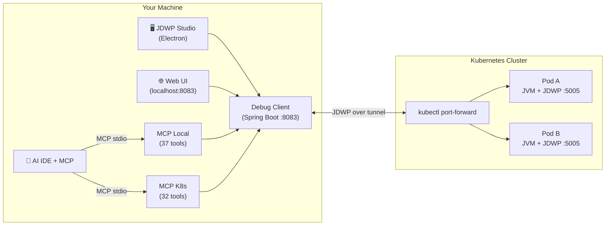

# JDWP Live Debugger

[](https://github.com/MaNiSh-9211/JDWP-remote-debugging/actions/workflows/ci.yml)
[](LICENSE)
[](https://openjdk.org)
[](https://spring.io/projects/spring-boot)
[](https://www.electronjs.org)
[](https://modelcontextprotocol.io)

**Attach a full debugger to Java JVMs running in Docker & Kubernetes — without stopping them, without redeploying, and without blocking other requests.**

Most debuggers force an ugly trade-off in production: either you don't debug at all, or you suspend whole threads/processes and take your users down with you. JDWP Live Debugger solves this with *request-scoped debugging*: only the specific request you tag gets paused at a breakpoint — every other request flows through untouched.

## How we compare

| Capability | IntelliJ IDEA | Google Cloud Debugger | Rookout | **This project** |
|---|---|---|---|---|
| Non-blocking breakpoints | ❌ pauses thread | ✓ snapshots | ✓ | ✅ request-scoped |
| Logpoints (trace, no pause) | ✓ | ✓ | paid tier | ✅ |
| Expression conditions | ✓ full IDE | limited | ✓ | ✅ comparisons + logic |
| Hit-count gates | ✓ | ✗ | ✓ | ✅ |
| Conditional logpoints | ✗ | ✗ | paid tier | ✅ |
| Per-BP enable/disable | ✓ | ✗ | ✓ | ✅ |
| Drop frame / rewind | ✓ | ✗ | ✗ | ✅ |
| TimeLens (causality timeline) | ✗ | ✗ | ✗ | ✅ |
| Panic stop (clean-exit) | n/a | ✗ | partial | ✅ |
| K8s pod attach via UI | plugin | GKE only | agent install | ✅ any cluster |
| AI-driven debugging (MCP 69 tools) | ✗ | ✗ | ✗ | ✅ |
| Self-hosted, open source | ✗ proprietary | ✗ proprietary | ✗ proprietary | ✅ MIT |

> Comparison based on publicly documented features as of early 2026. Cloud Debugger is deprecated. Rookout was acquired by Nimble.



---

## Table of contents

- [Why this exists](#why-this-exists)
- [Quick start](#quick-start)
- [Download prebuilt](#download-prebuilt)
- [Features](#features)
- [Architecture](docs/architecture.md)
- [Security model](docs/security.md)
- [API reference](docs/api-reference.md)
- [Production debugging](docs/production-debugging.md)
- [Environment variables](docs/environment-vars.md)
- [Troubleshooting](#troubleshooting)
- [Contributing](CONTRIBUTING.md)
- [Changelog](CHANGELOG.md)

## Why this exists

| Traditional remote debugging | JDWP Live Debugger |
|---|---|
| Breakpoint suspends **all** traffic through that code path | Only the request you tag is suspended; all others proceed |
| Requires app restart with `suspend=y` | Attaches to a **running** JVM (`suspend=n`) |
| JDWP port opened on NodePort/LoadBalancer | JDWP stays ClusterIP-only; access via `kubectl port-forward` |
| Debugging is human-only activity | First-class MCP server so AI IDEs can set breakpoints and read variables |
| No trace of who debugged what | Session-based audit trail with automatic timeouts |

## Quick start (Docker, 3 minutes)

Prerequisites: JDK 21+, Maven 3.9+, Docker.

```bash
# 1. Start the demo target
docker compose up -d --build

# 2. Start the debug client
cd client && mvn spring-boot:run

# 3. Open the web UI
#    http://localhost:8083 → Connect to host=localhost port=5005
```

Try it: set a breakpoint at `UserController:getUsers` line 29, then click **GET /users**. The containerized app pauses at your breakpoint — inspect variables, step, resume.

### Desktop app (Electron)

```bash
cd client/jdwp-desktop
npm run windows    # or: npm run macos | npm run linux
```

### One-command Kubernetes demo (Kind)

```bash
powershell -File scripts/e2e-live-debug.ps1
```

This creates a real Kind cluster, deploys two Java pods, attaches through port-forward, sets a breakpoint, proves untagged traffic isn't blocked, and verifies tagged-request suspension — all automated.

### AI IDE integration (MCP)

```bash
cd jdwp-mcp && npm install && npm run build
```

Add to `.cursor/mcp.json` (see `jdwp-mcp/cursor-mcp-config.example.json`):

```json
{
  "mcpServers": {
    "jdwp": {
      "command": "node",
      "args": ["/absolute/path/to/jdwp-mcp/dist/index.js"]
    }
  }
}
```

Your AI IDE can now set breakpoints, inspect variables, evaluate expressions, and run full auto-debug workflows — 37 tools locally plus 32 Kubernetes tools via the second server.

## Download prebuilt

Prebuilt artifacts ship with every [release](https://github.com/MaNiSh-9211/JDWP-remote-debugging/releases):

| Asset | Purpose |
|-------|---------|
| `JDWP.Studio.Setup.*.exe` | Windows installer |
| `JDWP.Studio-*-arm64.dmg` | macOS app |
| `JDWP.Studio.*.AppImage` | Linux app |
| `debug-client-1.0.0.jar` | Debug client (JDK 21+ required) |
| `console-log-agent.jar` | Standalone log-capture agent |

Container images on GHCR:

```bash
docker pull ghcr.io/manish-9211/jdwp-debug-server:latest
```

## Features

### Non-blocking breakpoints
Set breakpoints that only pause requests carrying your `X-Debug-Request-Id` header. All other traffic flows through untouched — verified against live Kubernetes clusters.

### Logpoints
Trace without pausing: `{var}` template tokens render local variable values into the log stream at any line, with optional conditions.

### Expression conditions
Breakpoint conditions support comparisons (`>`, `<`, `>=`, `<=`, `==`, `!=`), boolean literals, string literals, numeric operands, and logical operators (`&&`, `||`) over in-scope variables.

### Hit-count gates
"Break after N hits" — skip warmup requests and catch the one that matters.

### Per-breakpoint control
Enable/disable individual breakpoints without removing them; mute/unmute globally.

### Drop frame
Rewind execution to the last application frame and re-run it.

### TimeLens — request causality recorder
Mark 2–5 lines once; every matching request gets its entire journey recorded as an ordered timeline with delta-timing and full variable state at each step. Zero pausing.

### Panic Stop
One button: resume all threads, remove all breakpoints, detach from VM. Leaves production exactly as found.

### Live container logs
NDJSON socket appender streams application logs from inside containers to the debug client — no agent injection needed for Docker targets.

### Kubernetes attach
Context discovery → pod discovery → port-forward → attach. Works with any cluster your kubeconfig can reach.

### Services browser
Connect GitHub or Bitbucket tokens to list repositories, match them to running pods by name, and jump straight to debugging.

### AI-ready via MCP
Two MCP servers expose 69 total tools so AI IDEs can drive the entire debugger programmatically.

### Security-first defaults
Token auth with constant-time comparison and brute-force lockout · CIDR target allow-list · idle-session watchdog · audit JSONL · secret redaction · localhost bind · locked-down CORS · least-privilege RBAC · sandboxed Electron.

## Documentation

| Document | Contents |
|----------|----------|
| [Architecture](docs/architecture.md) | Components, data flow, design decisions, 10 diagrams |
| [Diagrams](docs/diagrams.md) | 10 Mermaid diagrams covering every subsystem |
| [Performance](docs/performance.md) | Real measured benchmarks from live cluster tests |
| [Security model](docs/security.md) | Threat model, hardening guide, controls reference |
| [API reference](docs/api-reference.md) | Every REST endpoint with parameters and examples |
| [Production debugging](docs/production-debugging.md) | Filter-lib & dynamic-agent rollout guide |
| [Environment variables](docs/environment-vars.md) | All configuration knobs in one table |
| [Contributing](CONTRIBUTING.md) | How to build, test, and submit changes |
| [Changelog](CHANGELOG.md) | Release history |

## Prove it yourself (live cluster, one command)

```powershell
powershell -File scripts/e2e-live-debug.ps1
```

Expected output ends with `ALL CHECKS PASSED`, having verified:
1. Pods reach `Running` in a real Kubernetes cluster
2. Debugger attaches through the port-forward tunnel
3. Untagged HTTP requests complete normally (**never blocked**)
4. Tagged request suspends **inside the pod**
5. Variables readable from suspended pod thread
6. Resume completes the request

## FAQ

**Does this actually not block production traffic?**
Yes. Verified against a live Kubernetes cluster — untagged requests complete in normal time (83–425ms observed). Only requests carrying your `X-Debug-Request-Id` header pause. See `scripts/e2e-live-debug.ps1` to prove it on your own cluster.

**How is this different from IntelliJ's remote debug?**
IntelliJ suspends the thread for ALL users when it hits your breakpoint. We suspend only the request you tagged. Everyone else gets a response in normal time.

**Do I need to install anything on the target pods?**
Just enable JDWP via `JAVA_TOOL_OPTIONS` env var — no agent JARs on the classpath, no code changes, no sidecar containers.

**Is this secure enough for production?**
The security model assumes the debugger is privileged and layers controls accordingly: token auth with lockout, CIDR allow-listing, idle disconnect, audit trail, secret redaction, RBAC without exec/write verbs, port-forward-only access (no exposed JDWP ports), and a panic button that removes all instrumentation instantly.

**Can I use this from a browser?**
Yes — the web UI at `localhost:8083` has full debugger parity including cluster attach (server-side kubectl). The Electron desktop app adds source viewing and a read-only kubectl terminal.

**Can AI IDEs use this?**
Yes — two MCP servers expose 69 tools so Cursor/Claude can set breakpoints, inspect variables, evaluate expressions, and run auto-debug workflows programmatically.

## Troubleshooting

| Symptom | Cause | Fix |
|---|---|---|
| Connection refused on 5005 | Target not running / port not forwarded | Check `docker ps` or re-run port-forward |
| Attach fails, ping OK | Another debugger attached, or wrong port | Disconnect other IDEs; verify port-forward targets 5005 |
| Breakpoint never hits | Class not loaded yet | Trigger the endpoint once, or set BP after first request |
| Variables show `<unavailable>` | Compiled without debug info | Build with `-g` (Spring Boot does by default) |
| Condition eval fails | Expression uses unsupported syntax | Supported: vars, fields, no-arg methods, comparisons, `&&`/`||` |
| Logpoint entry missing | Target runs in Docker without socket appender | Add `ClientSocketAppender` to target's logback config |

## Contributing

See [CONTRIBUTING.md](CONTRIBUTING.md). CI runs gitleaks + builds on every push — keep secrets out and tests passing.

## License

[MIT](LICENSE)
