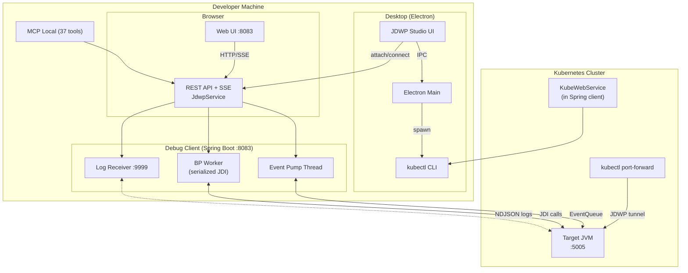
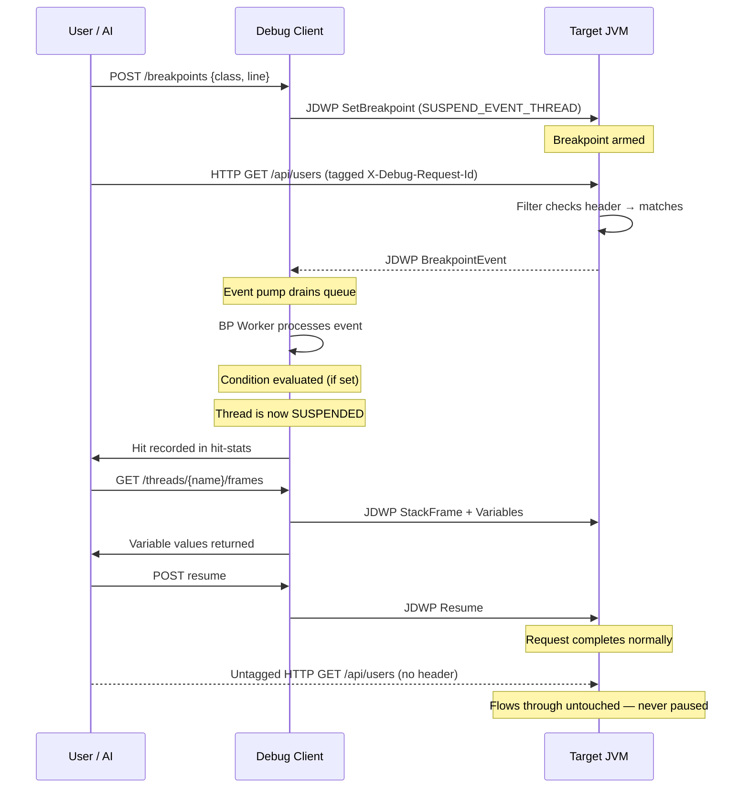
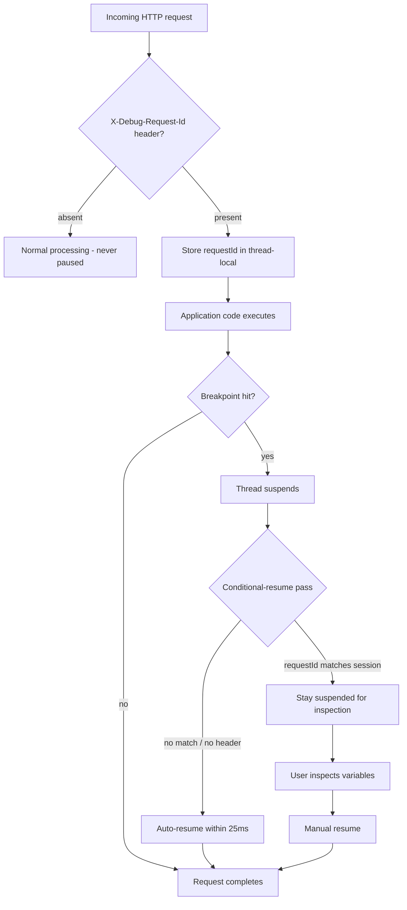

# Architecture

## System overview

## Components

| Component | Tech | Role |
|---|---|---|
| **Debug Client** (`client/`) | Spring Boot 3, JDI | Core debugger engine: attaches to target JVMs, manages breakpoints, exposes REST+SSE API on `:8083`, injects log agent, serves web UI. |
| **Event Pump** | Daemon thread inside JdwpService | Drains `VirtualMachine.eventQueue()` — the only way JDWP suspension actually happens. Routes events to serialized bp-worker. |
| **BP Worker** | Single-thread executor | Processes breakpoint hits (conditions, logpoints, recorder capture) while holding the service monitor to serialize JDI access. |
| **Conditional-Resume Pass** | 25ms polling thread | Auto-resumes threads that don't match request-scoped criteria. This is what makes debugging non-blocking. |
| **Idle Watchdog** | Scheduled task | Disconnects sessions idle > N minutes; resumes suspended threads first. |
| **Audit Service** | Async JSONL writer | Records connect/disconnect/breakpoint actions to `logs/audit.jsonl`. |
| **Secret Redactor** | Static utility | Masks JWT/JWE, AWS keys, auth headers, credential fields before strings reach UI/logs. |
| **JDWP Studio** (`client/jdwp-desktop/`) | Electron + React | Desktop shell with source view, variable tree, HTTP replay, kubectl terminal. Hardened: sandbox, CSP, IPC allow-lists. |
| **Web UI** (`client/ui/`) | React + Vite | Browser-based interface served from the client at `:8083`. Full parity via server-side `/api/k8s/*` endpoints. |
| **Demo Target** (`server/`) | Spring Boot 3 | Sample app with JDWP + NDJSON log appender for testing the entire pipeline. |
| **MCP Server (local)** (`jdwp-mcp/`) | TypeScript | 37 tools exposing the Debug Client API to AI IDEs. |
| **In-cluster Debugger** (`k8s-debug/`) | Spring Boot 3, fabric8 | Runs inside Kubernetes: pod discovery, port-forward management, session timeouts, audit logging on `:8090`. |
| **debug-filter-lib** | Spring Boot auto-config | Servlet filter that pauses only requests carrying `X-Debug-Request-Id`. |
| **debug-agent** | Java agent | Same selective-pause capability, attachable at runtime via Instrumentation. |
| **KubeWebService** (`client/k8s/`) | ProcessBuilder → kubectl | Server-side cluster access for the web UI: contexts, namespaces, pods, logs, port-forwards. Read-only + tunneling only. |

## Data flow: a breakpoint hit, end to end

## Non-blocking mechanism

## Design decisions (ADRs)

### ADR-001: Dedicated event pump thread

**Context:** JDI only applies a request's suspend policy when the debugger reads the `EventSet` from `VirtualMachine.eventQueue()`. Without this read, breakpoints fire on the wire but suspend nothing.

**Decision:** A dedicated daemon thread continuously calls `eventQueue().remove()` and routes events.

**Consequences:** Breakpoints actually work. Slow condition evaluation or logpoint rendering must not run on this thread — they are offloaded to the serialized BP worker so draining continues unblocked.

### ADR-002: Serialized BP worker for JDI access

**Context:** com.sun.jdi is not thread-safe. The service uses `synchronized` methods for HTTP-thread access, but the pump and worker threads also make JDI calls.

**Decision:** A single-thread executor processes breakpoint events sequentially while holding the service monitor (via `synchronized processBreakpointEventSerialized`). All other JDI entry points are also `synchronized`.

**Consequences:** Correct but serial. At very high event rates the worker becomes a bottleneck. Acceptable for single-developer use.

### ADR-003: Port-forward instead of exposing JDWP

**Context:** JDWP has no auth/TLS of its own. Network access = full JVM control.

**Decision:** JDWP stays ClusterIP-only. Access via short-lived `kubectl port-forward` sessions managed by the app.

**Consequences:** Attack surface reduced to nearly zero. Requires RBAC `pods/portforward create`. Tunnel lifecycle must be tracked (the app does this).

### ADR-004: NDJSON socket appender for container log streaming

**Context:** The Attach API can only reach local JVMs. Container targets can't be injected with agents.

**Decision:** The demo target includes a `ClientSocketAppender` that streams NDJSON to the debug client's receiver on port 9999. No injection needed for Docker/K8s targets.

**Consequences:** Works out of the box for containers. Requires target to include the appender (demo does). For non-modified targets, local-JVM injection still works.

### ADR-005: Server-side kubectl for web UI cluster access

**Context:** Browsers cannot spawn local processes. Without server-side endpoints, the web UI couldn't do cluster operations.

**Decision:** `KubeWebService` runs kubectl via `ProcessBuilder` (no shell) with strict identifier validation and an allow-list of read-only verbs plus port-forward.

**Consequences:** Web UI has full cluster parity. Security surface limited to validated kubectl invocations. Covered by token filter + rate limiter.
