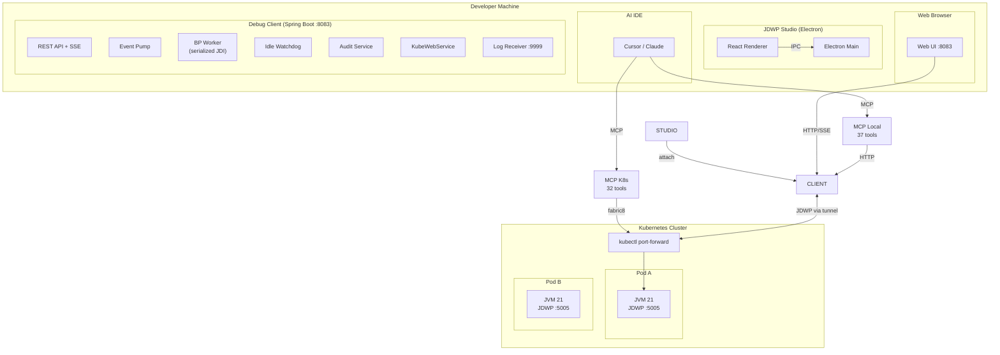
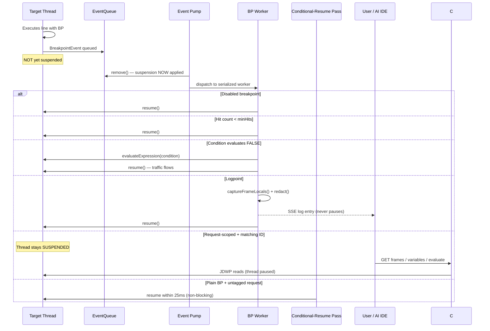
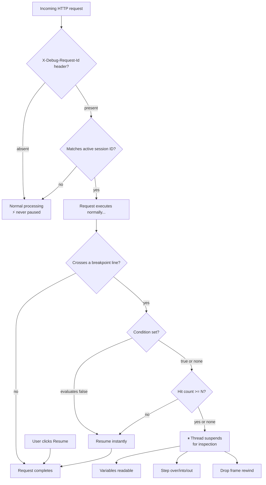
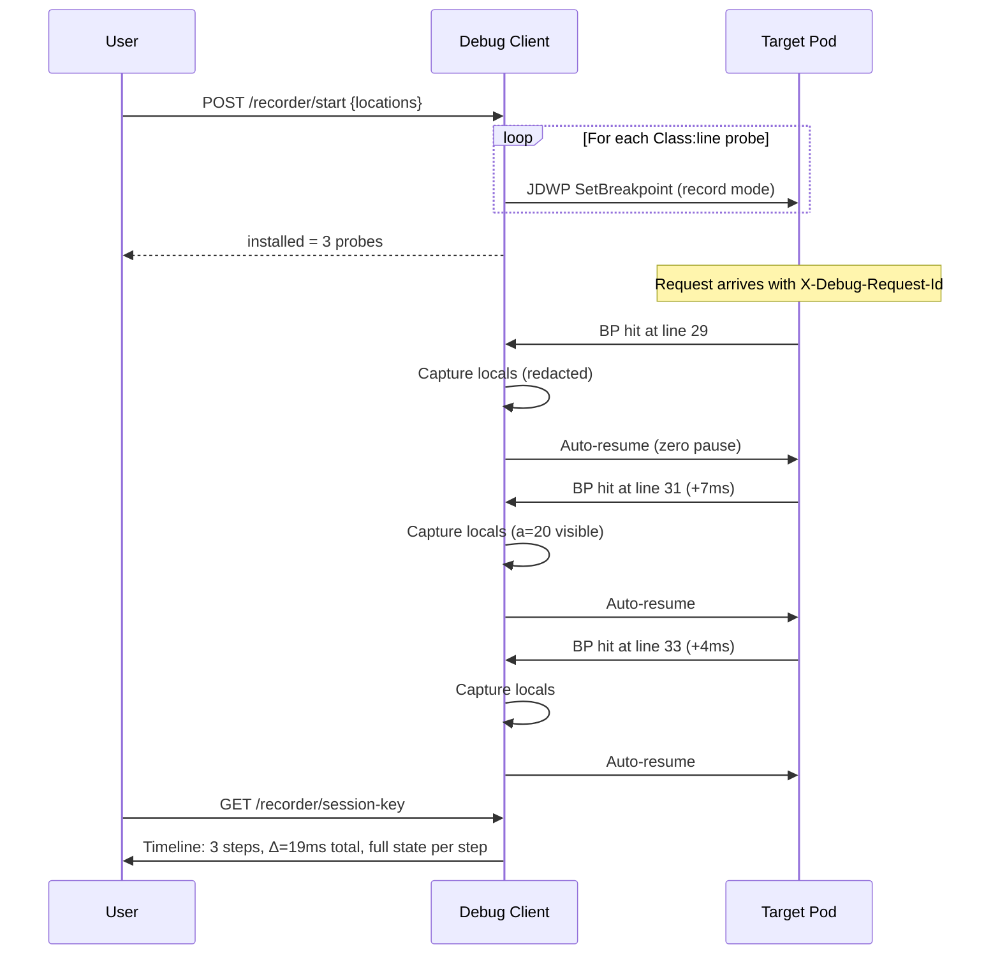
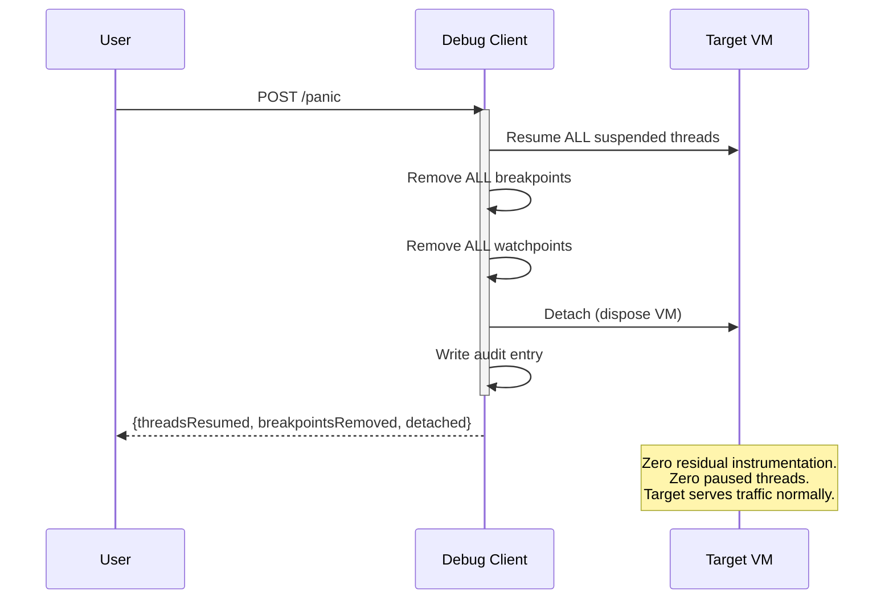
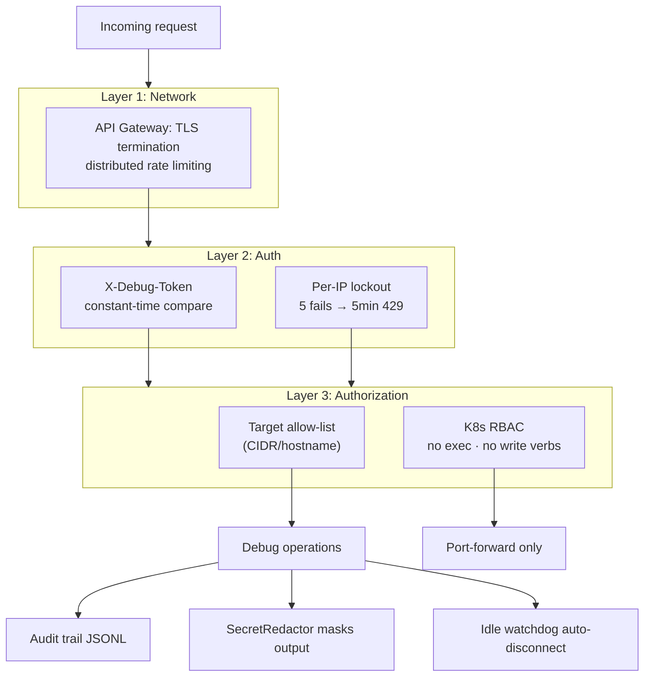
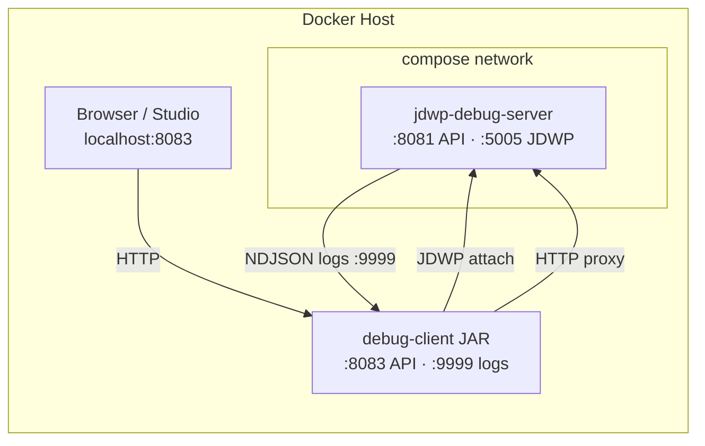
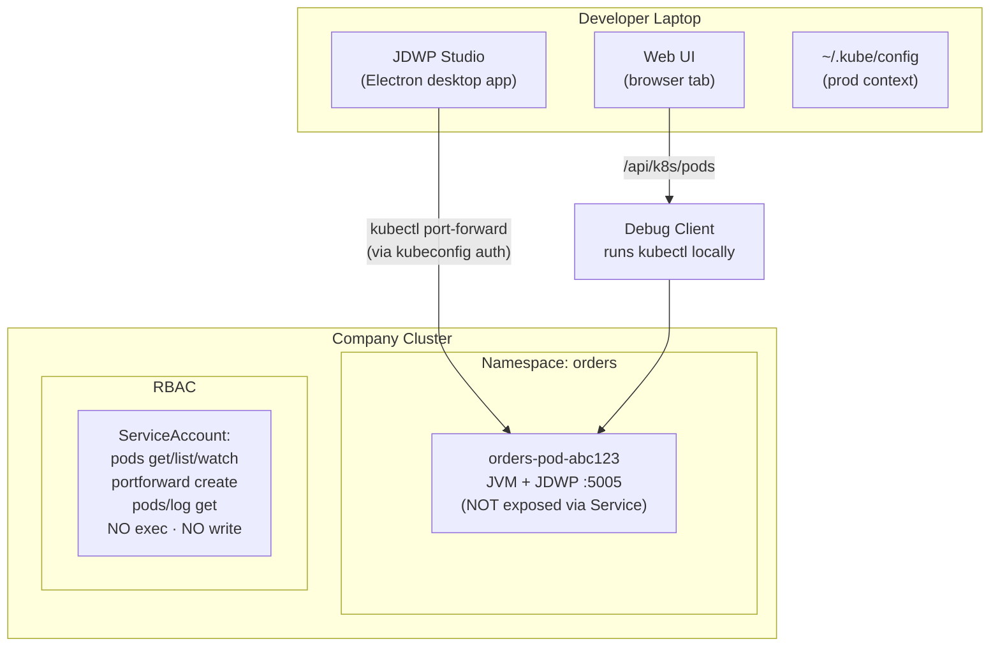
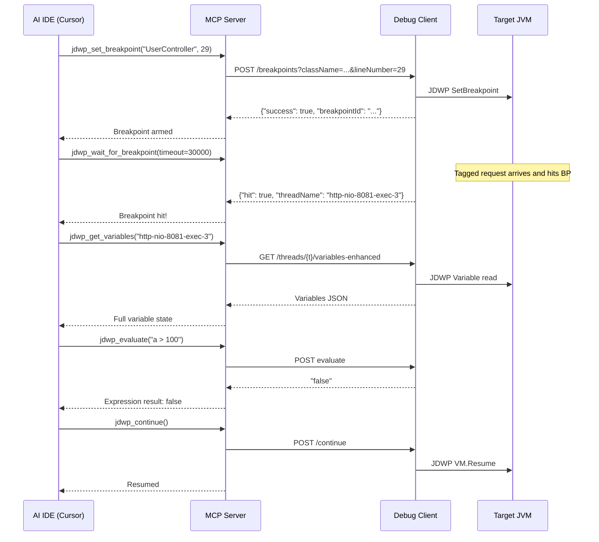
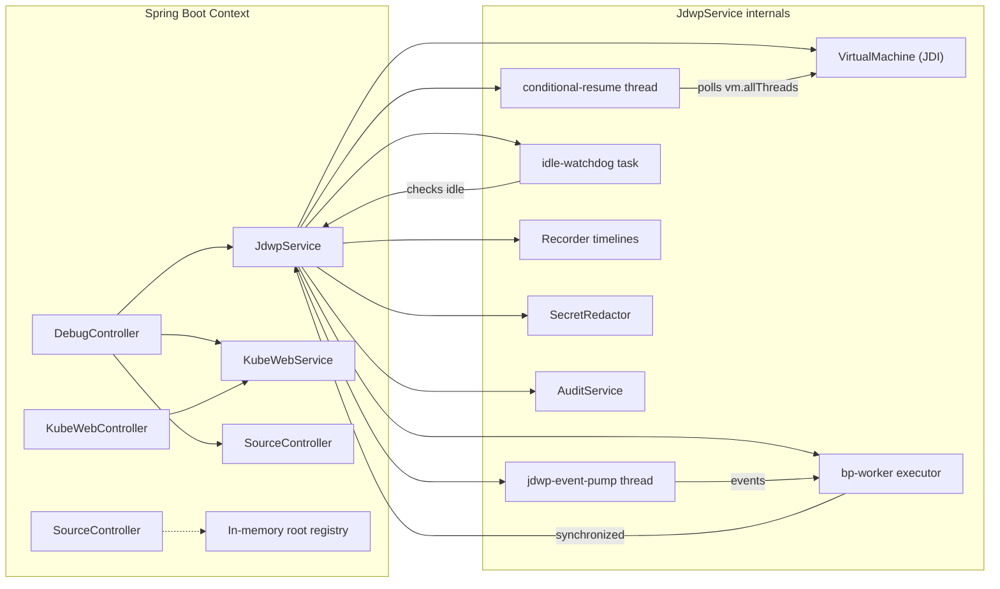

# Diagrams

Every major subsystem visualised. All diagrams are [Mermaid](https://mermaid.js.org) and render natively on GitHub.

---

## 1. System overview

---

## 2. Breakpoint hit: complete event pipeline

---

## 3. Non-blocking decision tree

---

## 4. TimeLens recording pipeline

---

## 5. Panic stop: clean-exit guarantee

---

## 6. Security defence layers

---

## 7. Deployment topology: Docker Compose (local)

---

## 8. Deployment topology: Kubernetes production

---

## 9. MCP integration: AI-driven debugging

---

## 10. Component interaction map

