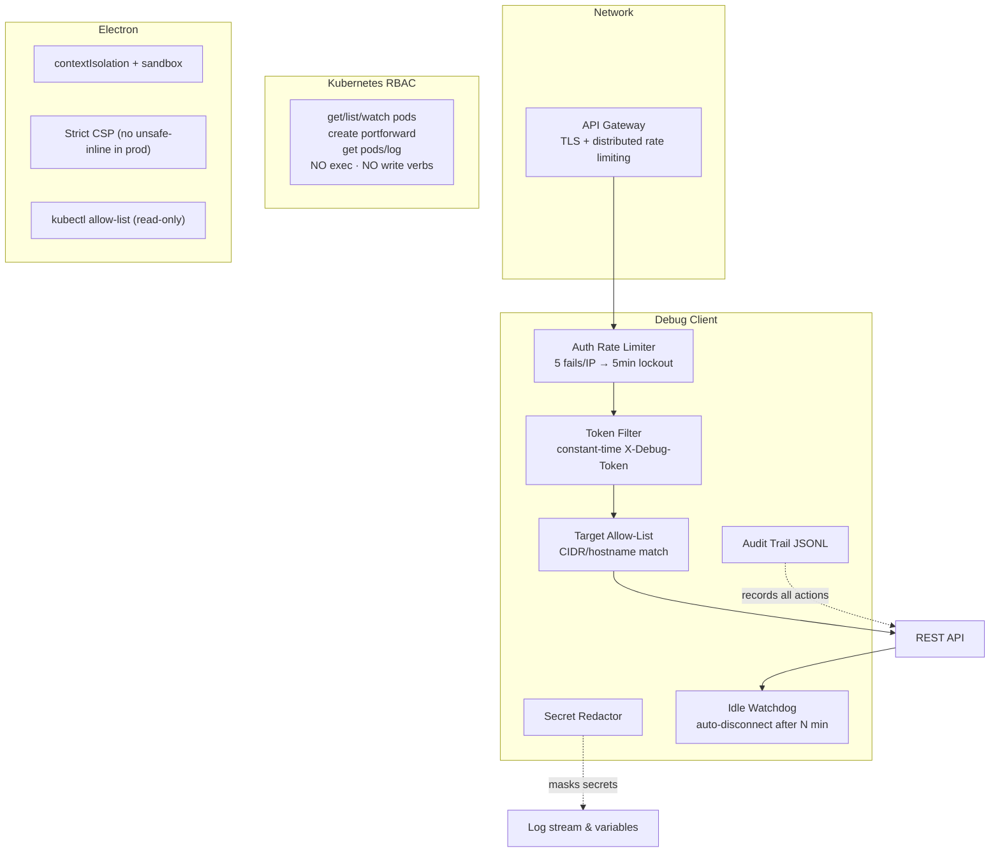

# Security Model

JDWP remote debugging is inherently privileged: a debugger can read every variable in a running JVM. This document describes the controls that make that safe, and what **you** must configure when deploying.

## Security layers



## Threat model

| Threat | Mitigation |
|---|---|
| Attacker reaches JDWP port of a production JVM | JDWP is never published. ClusterIP-only + on-demand `kubectl port-forward`. NetworkPolicy restricts in-cluster access to 5005. |
| Rogue process on developer machine calls Debug Client API | Client binds `localhost` by default; `JDWP_API_TOKEN` enables constant-time token auth; CORS is explicit allow-list (no `*`). |
| Token brute-force | Per-IP rate limiter: 5 failures in 60s → 5-minute 429 lockout (constant-time compare). At scale, API gateway adds distributed rate limiting. |
| Debugger left attached to prod indefinitely | Idle watchdog auto-disconnects after 30 min (configurable), resuming suspended threads first. |
| Debugger used as SSRF pivot to internal JVMs | Target allow-list (`JDWP_ALLOWED_TARGETS`) restricts connect destinations by hostname/CIDR. |
| Secrets leak through captured variables/logs | SecretRedactor masks JWT/JWE, AWS keys, auth headers, credential fields before values reach UI/logs. Applied at all StringReference sites + log ingestion. |
| No trace of who debugged what | Audit trail (`logs/audit.jsonl`) records connect/disconnect/breakpoint events with timestamps. |
| Compromised renderer in Electron app | contextIsolation + sandbox, strict CSP, navigation guards, IPC allow-lists, kubectl restricted to read-only verbs. |
| Renderer tricks kubectl into destructive actions | Allow-list of read-only subcommands only; shell spawning disabled; metacharacters rejected. |
| Service account abused for lateral movement | RBAC grants only pods get/list/watch + portforward create + pods/log get. **No exec, no write verbs, no secrets access.** |
| Compromised renderer (XSS) in the Electron app | Context isolation + sandbox enabled, strict CSP, navigation guards, `setWindowOpenHandler` denies all popups, IPC handlers validate inputs. |
| Renderer tricks kubectl into destructive actions | The cluster terminal only executes an allow-list of read-only subcommands (`get`, `describe`, `logs`, …). Shell spawning is disabled and metacharacters are rejected. |
| Service account abused for lateral movement | RBAC grants only `pods get/list/watch`, `pods/portforward create`, `pods/log get`. **No exec, no write verbs, no secrets access.** |
| Forgotten debug sessions keep production threads paused | Sessions auto-expire; in-cluster debugger tracks and closes port-forwards; audit log records every action with actor + timestamp. |
| Secrets leak through captured logs/variables | Log capture runs locally between client and target; nothing is persisted server-side. Scrub headers before replaying requests you don't own. |

## Debug Client API hardening

The client ships secure-by-default and hardens further with environment variables:

```bash
# Require a bearer token on every /api call (constant-time compared):
export JDWP_API_TOKEN="$(openssl rand -hex 32)"

# Brute-force lockout: 5 failed attempts per IP in 60s -> 5-minute 429 lockout
# (tunable: jdwp.auth.max-failures / window-ms / lockout-ms)

# Restrict which JVMs the client may attach to (hosts or IPv4 CIDRs):
export JDWP_ALLOWED_TARGETS="localhost,127.0.0.1,10.0.0.0/8"

# Auto-disconnect idle JDWP sessions after N minutes (production safety; 0 = off):
export JDWP_SESSION_IDLE_TIMEOUT_MINUTES=30

# Bind beyond localhost ONLY if the token is set:
export JDWP_SERVER_ADDRESS=0.0.0.0   # e.g. when running the client in a container

# Restrict browser origins that may call the API:
export JDWP_CORS_ALLOWED_ORIGINS="http://localhost:5177"
```

Clients then send `X-Debug-Token: <token>` or `Authorization: Bearer <token>`.
Only `/api/debug/ping` (a liveness check) is exempt.

## Additional controls

| Control | Where |
|---|---|
| **Audit trail** — append-only JSONL (`logs/audit.jsonl`, `jdwp.audit.file`) recording connect/disconnect/breakpoint events | client `AuditService` |
| **Secret redaction** — JWT/JWE, AWS keys, auth headers, credential fields masked before strings reach UI/logs | client `SecretRedactor` + server `ClientSocketAppender` |
| **Idle watchdog** — resumes suspended threads then disconnects idle sessions | client `IdleSessionWatchdog` |
| **Git provider isolation** — tokens memory-only; HTTPS to fixed hosts only; owner/repo/branch validated before URL use | desktop `git-providers.cjs` |
| **Read-only kubectl terminal** — subcommand allow-list, no shell, metacharacter rejection | desktop `cluster-exec.cjs` |

## Kubernetes hardening checklist

- [ ] JDWP containerPort exists on the pod but **not** on any Service
- [ ] Debugger Deployment uses the least-privilege ServiceAccount (`k8s-debug/k8s-manifests/rbac.yaml`)
- [ ] NetworkPolicy allows 5005 ingress only from the debugger's namespace (see `k8s-remote-debug/k8s/network-policy.yaml`)
- [ ] Pods run `runAsNonRoot`, read-only root filesystem where possible, no privilege escalation
- [ ] `kubectl port-forward` sessions are short-lived and closed after debugging
- [ ] Audit log from the in-cluster debugger shipped to your logging stack

## Protocol-level caveats

- **JDWP is plaintext.** Anyone who can observe the tunnel can read debug traffic. Use SSH/port-forward/VPN; never expose 5005 via NodePort/LoadBalancer/Ingress.
- **JDWP has no authentication.** Possession of network access to the port equals full control of the JVM. This is why the default posture is "tunnel only".
- **`suspend=y` blocks startup.** All tooling here uses `suspend=n`; the demo images enforce this.

## Reporting vulnerabilities

Open a private security advisory via GitHub ("Security" → "Report a vulnerability") rather than a public issue.
